# 🧠 Self-Corrective RAG with LangGraph & Gemini


A robust **Retrieval-Augmented Generation (RAG)** system built with **LangGraph** and **Google Gemini**. This system goes beyond simple RAG by implementing a **self-corrective mechanism**: it evaluates the relevance of retrieved documents and, if necessary, rewrites the search query to find better results.

## ✨ Features

- **🔍 Self-Correction**: Automatically detects when retrieved documents are irrelevant.
- **🔄 Query Transformation**: Re-writes user queries to optimize them for vector search if initial retrieval fails.
- **⚖️ Relevance Grading**: Uses an LLM (Gemini) to grade the relevance of each retrieved document.
- **🛡️ Hallucination Prevention**: Filters out irrelevant context before generating answers.
- **📊 State Management**: Uses Pydantic models for robust state handling throughout the graph.

## 🛠️ Tech Stack

- **Orchestration**: [LangGraph](https://python.langchain.com/docs/langgraph)
- **LLM**: Google Gemini (`gemini-2.5-flash`)
- **Vector Store**: ChromaDB
- **Embeddings**: HuggingFace (`BAAI/bge-small-en-v1.5`)
- **Framework**: LangChain
- **Validation**: Pydantic

## 🚀 Installation

1. **Clone the repository:**
   ```bash
   git clone https://github.com/MahdiAmrollahi/Self-Corrective-RAG.git
   cd Self-Corrective-RAG
   ```

2. **Create a virtual environment (optional but recommended):**
   ```bash
   python -m venv env
   # Windows
   .\env\Scripts\activate
   # Linux/Mac
   source env/bin/activate
   ```

3. **Install dependencies:**
   ```bash
   pip install -r requirements.txt
   ```

4. **Set up Environment Variables:**
   Create a `.env` file in the root directory and add your Google API Key:
   ```env
   GOOGLE_API_KEY=your_google_api_key_here
   ```

## 📖 Usage

### 1. Data Ingestion (Indexing)
First, you need to process your documents and save them into the vector database. Place your documents (PDF, PPTX, TXT) in the `data/` folder and run:

```bash
python one.py
```
*This script will load documents, split them into chunks, embed them, and store them in ChromaDB.*

### 2. Running the RAG System
To interact with the system and test the graph flow:

```bash
python test_graph.py
```
You will be prompted to enter a query. The system will then:
1. Retrieve documents.
2. Grade them.
3. If relevant -> Generate an answer.
4. If not relevant -> Rewrite query and try again (up to 3 times).

### 3. Visualize the Graph
To generate an image of the workflow graph:

```bash
python save_graph_image.py
```
This will create a `workflow.png` file showing the nodes and edges.

## 🧠 How It Works (The Graph)

The system follows a state machine workflow defined in `main.py`:

```mermaid
graph TD
    Start([Start]) --> Retrieve[🔍 Retrieve]
    Retrieve --> Grade[⚖️ Grade Documents]
    Grade --> Check{Relevant Docs Found?}
    
    Check -- Yes --> Generate[💡 Generate Answer]
    Check -- No --> Decision{Max Retries?}
    
    Decision -- No --> Transform[🔄 Transform Query]
    Decision -- Yes --> Generate
    
    Transform --> Retrieve
    Generate --> End([End])
```



1. **Retrieve**: Fetches top-k documents from ChromaDB based on the user query.
2. **Grade Documents**: The LLM evaluates each document. If it's irrelevant, it's discarded.
3. **Decide to Generate**:
   - If we have relevant documents, proceed to **Generate**.
   - If NO relevant documents are found, proceed to **Transform Query** (unless max retries reached).
4. **Transform Query**: The LLM rewrites the query to be more semantic and optimized for retrieval, then loops back to **Retrieve**.
5. **Generate**: Produces the final answer using the filtered, relevant context.

## 📂 Project Structure

```
.
├── data/                  # Source documents (PDFs, etc.)
├── chroma_db/             # Vector database storage (generated)
├── main.py                # Core logic: Graph definition, Nodes, Pydantic models
├── one.py                 # Data ingestion script
├── test_graph.py          # Script to run and test the system
├── save_graph_image.py    # Utility to visualize the graph
├── requirements.txt       # Python dependencies
└── README.md              # Project documentation
```

## 🤝 Contributing

Contributions are welcome! Please feel free to submit a Pull Request.
